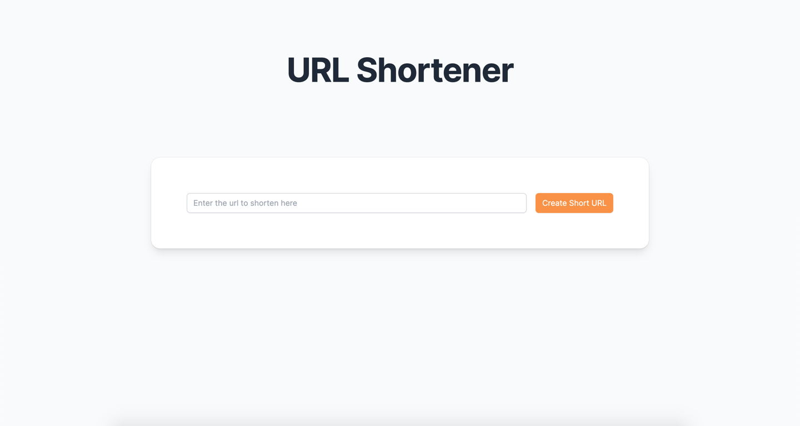
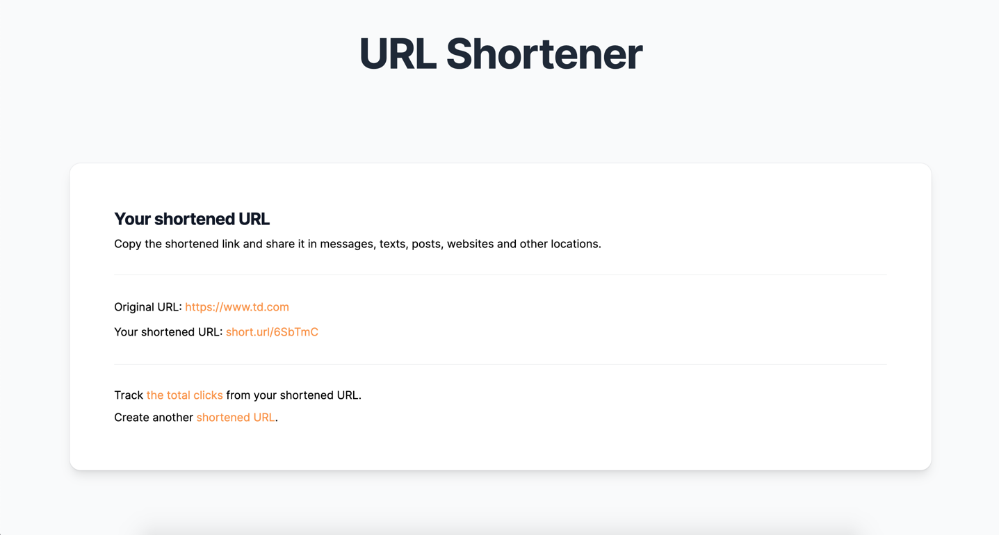
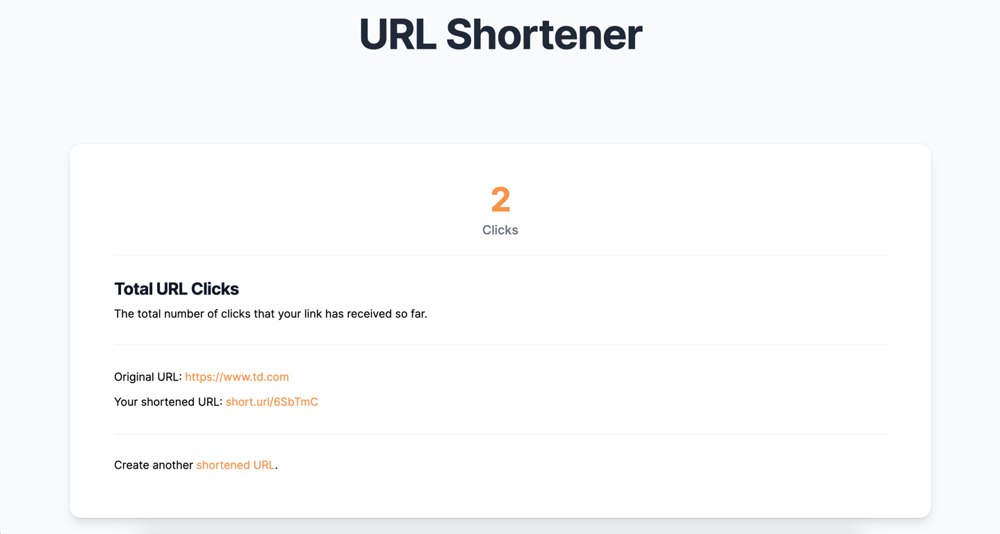

# README

# URL Shortener

This app is a url shortener. Provide your url and it will return a short code of it.

## Instructions

* Create a simple URL shortening service, like https://www.shorturl.at/
* The home page should have a form with a text box that contains the url to redirect to
* Submitting the form should bring you to a page that contains the shortened link (i.e. shorturl.at/cqKU7)
* There should also be a link on that page to a page to see the amount of times the link has been clicked
* Finally, visiting the shortened link should increment the number of time the link has been clicked, and redirect to the long version of the link.

## Screenshots & Demo
### Demo


### Screenshots





## Technologies
- Ruby 3.1.2
- Ruby on Rails 7
  
## Setup
After downloading the Git repository, follow the steps below to setup the application locally.

- Run rails bundle

```sh
rails bundle
```

## Database
This project use Postgresql as the database

- To create the database, run rails db:create
- Migrate the migration files with rails db:migrate

```sh
rails db:create
rails db:migrate
```
or 

```sh
rails db:setup
```

## Test
To run the system tests, run rails test test/system/urls_test.rb

```sh
rails test test/system/urls_test.rb  
```

## Contact

Created by [Krishna Diamesso](mailto:info@krishnadiamesso.io).

You can contact me at [info@krishnadiamesso.io](mailto:info@krishnadiamesso.io).
